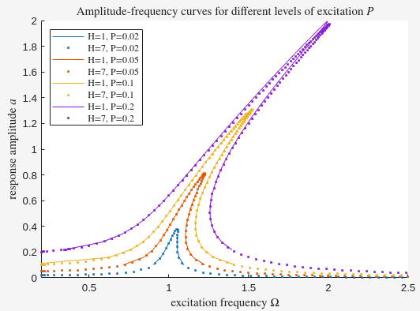
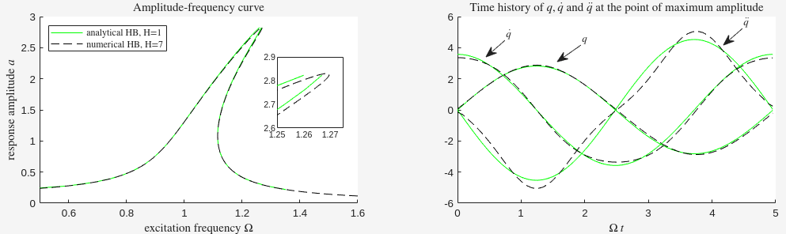
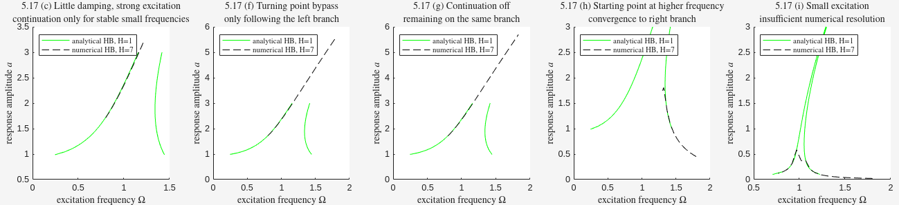

# duffing-hb
Analysis of the Duffing oscillator using the Harmonic Balance Method.

This repository contains MATLAB implementations and reproductions based on  
**_Harmonic Balance for Nonlinear Vibration Problems_ by Malte Krack and Johann Gross**.

## External Libraries and Licenses 

This project uses the [NLvib library](https://github.com/maltekrack/NLvib/) by [maltekrack](https://github.com/maltekrack), which is licensed under the GNU General Public License (GPL). 

Therefore, this repository is distributed under the same license. See [`NLvib-NLvib-Basic/LICENSE`](NLvib-NLvib-Basic/LICENSE) for more information.

To ensure full reproducibility, the version of NLvib as of **June 16, 2025** is included in this repository.

If you use or modify this code, please make sure to respect the terms of the GPL.

## Content

| Chapter | Description | Files | Figure |
|--------|-------------|-------|--------|
| Chapter 1 – Introduction | Reproduction of **Figure 1.2**: comparison of different levels of excitation | [`P_Comparison.m`](P_Comparison.m), [`HB_analysis.m`](HB_analysis.m), [`HB_residual_Duffing.m`](HB_residual_Duffing.m) |  |
| Chapter 5 – Exercise 1 | Following **Solved Exercise 1: Duffing Oscillator** | [`Duffing.m`](Duffing.m), [`HB_residual_Duffing.m`](HB_residual_Duffing.m) |  |
| Chapter 5 – Homework B 5.17 | Following **Homework B 5.17: Going Around Turning Points** | [`Going_around_turning_points.m`](Going_around_turning_points.m), [`HB_analysis.m`](HB_analysis.m), [`HB_residual_Duffing.m`](HB_residual_Duffing.m) |  |

